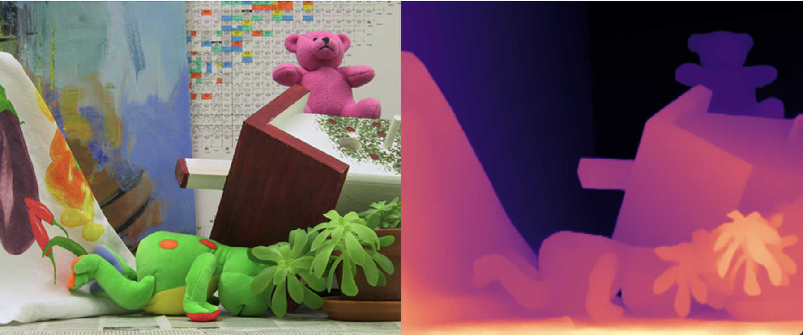
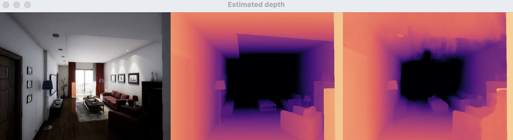

# OpensourceSW 입문 Project
> Original Code from ibaiGorordo's [ONNX-CREStereo-Depth-Estimation](https://github.com/ibaiGorordo/ONNX-CREStereo-Depth-Estimation)
### Team Introduction
##### 박성우 202211298 프로젝트 중 모든 역할

### Topic Introduction
## *Stereo Depth Estimation*
해당 Github Repo에서는
한번에 두개의 이미지 혹은 영상정보들이 인풋으로 들어가게 되고
ONNX기반의 CREStereo 모델을 통하여 두 인풋을 통해 하나의
depth이미지 예측결과를 도출해주는 Python Scripts를 다룹니다.

ONNX란? 간단하게 설명하면, pytorch같은 tensorflow 서로 다른 두 환경에서 만들어진 모델들을
서로 호환가능하게 ONNX로 변환하여 ONNX runtime위에서 실행할 수 있게 해주는겁니다.

Depth Map은 컴퓨터 그래픽스에서 요긴하게 이용되는 요소입니다.
그렇기에 당연히 게임에서 볼 수 있는 각종 효과들을 만들 때 사용되고 있는데요
이런 Depth Map은 보통 gpu에서 알아서 Depth Test라는 과정을 거쳐 연산된다.
(OpenGL의 경우 fragment shader의 처리 이후 depth buffer로 받아서 사용된다.)

하지만 사진등은(비트맵) 픽셀에 대한 정보만을 들고 있지 좌표나 그런 정보를 가지고 있는 것이 아니다.
때문에 depth map을 쓰고싶어도 제공받지 못하는 것인데.
이 repo는 두 장의 사진을 통해 depth 맵을 출력해낼 수 있는 AI 기술의 시연인 것이다.


picture from : https://www.ronja-tutorials.com/post/019-postprocessing-outlines/#normal-outlines
### Results(Image)
#### Input1

#### Result1


#### Input2
#### Result2

Stereo depth estimation on the cones images from the Middlebury dataset (https://vision.middlebury.edu/stereo/data/scenes2003/)

### Results(Video)
#### Input
this youtube video : https://youtu.be/Yui48w71SG0
#### Results

### Analysis/Visualization

### Installation / Inference
#### My Environment
* Macbook M1 Chip
* python3.11
* No Nvidia GPU

1. git clone
```
git clone https://github.com/seongwooPark22/opensw23-SWP.git
cd opensw23-SWP
```

1. Install requirements 

reqirements.txt 내부를 이렇게 바꿔주세요
만약 NVIDIA GPU를 사용하지 않는 컴퓨터라면 : ```onnxruntime-gpu``` -> ```onnxruntime```
만약 NVIDIA GPU를 사용하는 컴퓨터라면 -> ```onnxruntime-gpu``` -> 변경X

수정한 후 -> ```pip install -r requirements.txt``` 실행

Video Inference는 Youtube 영상의 URL을 사용할 수 있기 때문에
이를 실행하기 위해서는 yt-dlp를 설치해야합니다.
```pip install yt-dlp```

1. Download Pre-Trained Model
#### ONNX Model

The models were converted from the Pytorch implementation below by [PINTO0309](https://github.com/PINTO0309)
https://github.com/PINTO0309/PINTO_model_zoo/tree/main/284_CREStereo
The License of the models is Apache-2.0 License: https://github.com/megvii-research/CREStereo/blob/master/LICENSE

위 링크에서 .sh파일 받아 실행하여 생성된 파일을 models폴더로 옮겨 주세요
```
sh [file_you_download]
```
Note
> 윈도우 사용자라면, .sh 파일을 실행하기 위해 git bash를 사용하거나
> Cygwin 등을 사용하는 방법이 있으니 참고해주세요

저는 ```download_iter05_tensorrt.sh```로 모델을 다운로드 받았습니다.

1. Inference
* Image inference

* Video Inference (Youtube)

1. Additional Application
* Driving Stereo

* DepthAI


### Presentation
