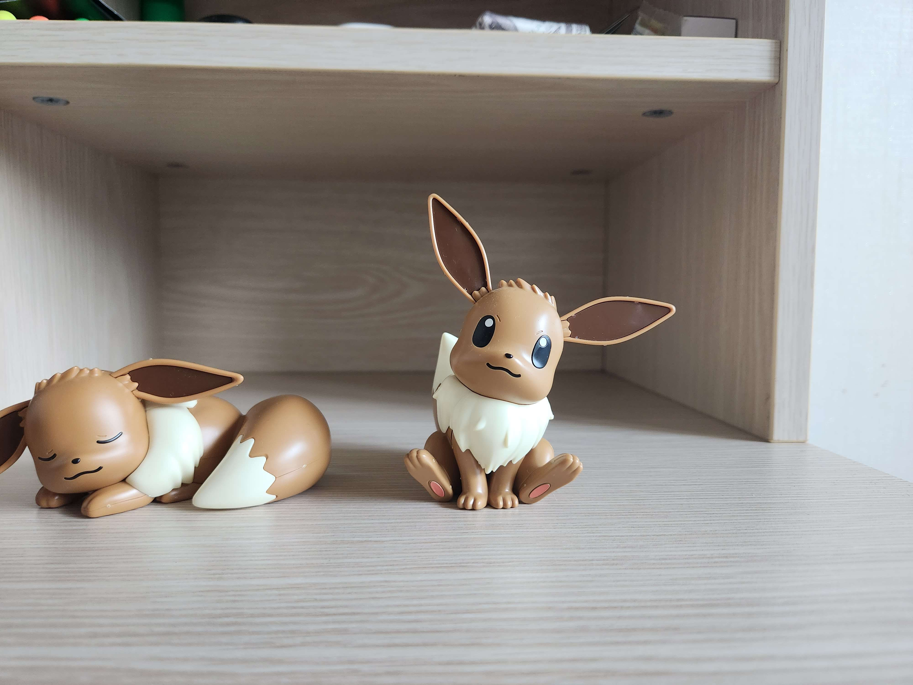
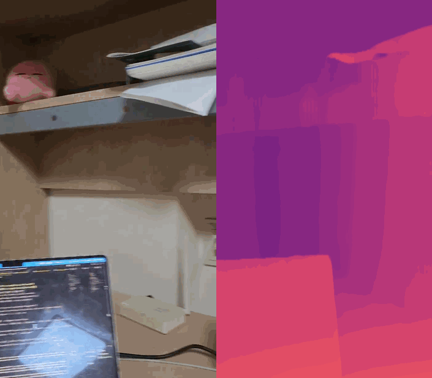

# OpensourceSW 입문 Project
> Original Code from ibaiGorordo's [ONNX-CREStereo-Depth-Estimation](https://github.com/ibaiGorordo/ONNX-CREStereo-Depth-Estimation)
### Team Introduction
##### 박성우 202211298 프로젝트 중 모든 역할

### Topic Introduction
## *Stereo Depth Estimation*
해당 Github Repo에서는
한번에 두개의(왼쪽과 오른쪽으로 편차가 있는 Stereo) 이미지 혹은 동영상정보들이
인풋으로 들어가게 되고 ONNX기반의 CREStereo 모델을 통하여 두 인풋을 통해 하나의
depth를 도출해주는 Python Scripts를 다룹니다.

> ONNX란? 간단하게 설명하면, pytorch같은 tensorflow 서로 다른 두 환경에서 만들어진 모델들을
> 서로 호환가능하게 ONNX로 변환하여 ONNX runtime위에서 실행할 수 있게 해주는겁니다.

Depth Map은 컴퓨터 그래픽스에서 요긴하게 이용되는 요소입니다.
그렇기에 게임에서 볼 수 있는 각종 그래픽 효과들을 만들 때도 많이 사용되고 있습니다.
현대의 대부분의 GPU는 하드웨어 레벨에서 이를 위한 depth testing 지원하고 있습니다.

* Depth Map을 활용한 Outline 효과 : https://www.ronja-tutorials.com/post/019-postprocessing-outlines/
* Pure Depth SSAO : https://theorangeduck.com/page/pure-depth-ssao

하지만 사진등은(비트맵) 픽셀에 대한 정보만을 가지고 있지 깊이 정보를 가지고 있지 않기 때문에
일반 사진, 영상에서 이 depth을 그냥 만들어낼 수는 없습니다.
그런 일반 사진에서 depth맵을 estimation하는 것이 이 Repo에서 다루고 있는 것입니다.

## Data Collecting
직접 수집한 데이터는 좌우 한쌍으로 총 10쌍을 준비했고, 8쌍은 이미지, 2쌍은 동영상으로 준비했습니다.

스테레오 카메라를 이용해야 가장 정확한 데이터를 얻을 수 있지만, 해당 기기를 가지고 있지 않기 때문에
직접 종이 등에 길이를 측정하고 재단하여 기준을 만들어 휴대전화를 이용하여 데이터를 만들었습니다.

혹은 지인에게 휴대전화를 빌려서 두개를 붙여서 영상을 촬영하는 식으로, 스테레오 카메라를 그나마 따라하여 촬영하였습니다.
## Results(Image)

### Input1
<p align="center">
    
    
</p>

### Result1


---
### Input2
<p align="center">
    
    
</p>

### Result2


---
### Input3
<p align="center">
    
    
</p>

### Result3


---
## Results(Video)
### Input1
사용한 영상 : input_files/video_left.mp4, input_files/video_right.mp4
### Result1
<p align="center">
    
    
    
</p>

---

### Input2
사용한 영상 : input_files/video2_left.mp4, input_files/video2_right.mp4
### Result2
<p align="center">
    
</p>

---

### Input3
유튜브 영상도 재생 됌을 시연하기 위하여 유튜브에서 찾은 영상을 사용했습니다.
영상 : https://youtu.be/fs_Uw4qL2O8

### Result3
<p align="center">
    
</p>

---

## Analysis/Visualization

### * Stereo Depth Estimation 원리 분석
Stereo 방식으로 Input으로 두개의 영상이 사용되며, 왼쪽 input, 오른쪽 input의 차이로 Depth를 추정한다.
(가까운건 밝게, 먼 것은 어둡게 표시)
이는 인간이 원근감을 느끼는 방식과 거의 유사함을 알 수 있는데
<p align="center">
    
</p>
사람의 눈은 위 그림처럼, 왼쪽눈에서 들어오는 정보와 오른쪽 눈에서 들어오는 정보를 규합하여
좌우의 상이 얼마나, 어떻게 다른지에 따라서 원근감을 느끼게 된다.
이를 인공지능 모델로서 유사하게 구현해낸 것으로 보인다.

### * Cross Eye에 적용해보기

사람의 눈과 비슷한 방식으로 depth를 측정한다고 생각하여 여러 CrossEye 영상들을 찾아 적용해 결과를 보고 싶었다.
<p align="center">
    
</p>

위처럼 왼쪽눈은 오른쪽 이미지, 오른쪽 눈은 왼쪽 이미지를 보고 상을 맞추기 때문에
Inference를 할 때 영상의 왼쪽 부분과 오른쪽 부분을 바꿔 입력 받은 경우 바꾸지 않은 경우로 나누어 퀄리티가 달라지는지 테스트 해보았다.

내가 직접 데이터를 만들어내면 이런 결과가 나오게 유도할 수 있기 때문에 외부의 영상(Youtube 영상)을 데이터로 사용하였다.
* 영상1 : https://youtu.be/QXPpUpD_oak
* 영상2 : https://youtu.be/4L-We9onn9s


left와 right 이미지를 바꾼 경우에 Output의 퀄리티가 달라지는 흥미로운 결과를 얻을 수 있었다.
바꾸지 않아도 어느정도 실행이 됨을 알 수 있지만, 바꾼 경우가 육안으로 봐도 더 잘 추론해냄을 알 수 있었다.

### * 모델별 Output 디테일 비교 그래프

모델들의 디테일과 효율을 따져보기로 했다. (Combined 모델만 사용함)


위 결과를 통해서 모델의 iter가 늘어나면 늘어날 수록 그 구분감과 Boundary가 깨끗해져 디테일이 올라가는 것을 알 수 있다.

사용하는 모델의 iter이 늘어나면 디테일이 좋아짐을 위 결과에서 알 수 있고.
모델의 resolution이 늘어나면 (input의 해상도가 아님) 모델이 만들어내는 Output의 해상도가 높아질 것이기 때문에 

iter20에 720x1280 모델로 생성된 Output을 Best Output으로 가정하고
다른 iter과 resolution인 모델들의 Output과 비교해보았다.

그래프 X축 : 실행시간 (Elapsed Time)
그래프 Y축 : Best Output과 얼마나 다른지. (0 = 완전히 같다. 1 = 완전히 다르다)
점들의 크기 : 점의 크기는 iter의 수(2, 5, 10, 20)와 대응된다 (크기가 제일 큰 것이 20, 제일 작은 것이 2라고 생각하면 된다.)
#### Comparing Graph1
<p align="center">
    
</p>


---
#### Comparing Graph2
<p align="center">
    
</p>


---
#### Average Graph


그래프를 분석해보자면
좌측 아래에 가까울수록, iter20에 720x1280의 디테일에 가까우면서 실행속도가 빠른 model이라고 할 수 있으므로
효율적인 모델이라고 부를 수 있을 것이다.

그렇기 때문에 사용한 ONNX모델 중 특히 Combined 모델 중에서 가장 효율적인 모델은 이 그래프만 보고 얘기하자면
480x640 중에서도 iter10이 가장 효율이 좋다고 할 수 있다.

만약 실행속도를 더 챙기고 싶다면, 480x640모델에서 iter2모델, 혹은 240x320모델의 iter5모델을 사용하는 것이 좋을 것이다.

#### * Some Weird Results
<p align = "left">
    
    
</p>

이어폰 선으로 생긴 원으로 뒤의 배경이 비치는데, 좌우의 사진에서 모두 비슷한 색의 배경이 찍히면서 면처럼 인식한 모양이다.
중간의 사진도 마찬가지로 글자의 배경이 되는 종이의 색상의 유사성과 그리고 글자의 대비가 너무 강해서 생기는 문제라고 생각한다.
## Installation / Inference
#### (참고) Tested Device
* Macbook M1 Chip, python3.11
* No Nvidia GPU
---
### 1. git clone
```
git clone https://github.com/seongwooPark22/opensw23-SWP.git
cd opensw23-SWP
```
### 2. Install requirements 

> venv나 virtualenv로 가상환경을 먼저 설정하고 하는 것을 추천합니다.

reqirements.txt 내부를 이렇게 바꿔주세요

* 만약 NVIDIA GPU를 사용하는 컴퓨터라면 -> `onnxruntime-gpu` -> 변경X
* 만약 NVIDIA GPU를 사용하지 않는 컴퓨터라면 : `onnxruntime-gpu` -> `onnxruntime`

수정한 후 
```
pip install -r requirements.txt
```

Video Inference 중에서도 video_depth_estimation는 Youtube 영상의 URL을 사용하기때문에
이를 실행하기 위해서는 yt-dlp를 설치해야합니다.
```
pip install yt-dlp
```

### 3. Download Pre-Trained Model
#### ONNX Model

The models were converted from the Pytorch implementation below by [PINTO0309](https://github.com/PINTO0309)

Model : https://github.com/PINTO0309/PINTO_model_zoo/tree/main/284_CREStereo
> The License of the models is Apache-2.0 License: https://github.com/megvii-research/CREStereo/blob/master/LICENSE

위 Model 링크에서 .sh파일 받아 실행하여 생성된 파일을 models폴더로 옮겨 주세요
```
sh [file_you_download]
```
주의
> 윈도우 사용자라면, .sh 파일을 실행하기 위해 git bash를 사용하거나
> Cygwin 등을 사용하는 방법이 있으니 참고해주세요

Inference 스크립트인 image_depth_estimation.py, video_depth_estimate_seperate_vid.py, video_depth_estimation_unified_vid.py는 소스코드에 명시된 iter과 resolution의 모델을 불러와 동작합니다.
그래서 사용하길 원하는 iter의 모델과 소스코드 내부의 iters의 값을 일치시켜주세요.
iter은 2, 5, 10, 20으로만 설정가능하며 숫자가 클수록 디테일이 좋아지고 느려집니다. 소스코드에서 직접 수정하실 수 있습니다.

resolution의 경우도 소스코드를 직접 수정해서 사용하셔야합니다. 존재하는 모델과 일치시켜 주세요.
마찬가지로 숫자가 클수록 디테일이 좋아지고 느려집니다.

그래서 바로 사용하시려면 iter5인 모델을 다운받으면 좋습니다. (기본 5라서)
저는 `download_iter05_tensorrt.sh`로 모델을 다운로드 받았습니다.

### 4. Start Inference
#### * Image inference (URL/파일을 인풋으로 작동함)
```
python image_depth_estimation.py
```
해당 파일을 실행하면 어떤 이미지 파일/URL을 사용할지 입력할 수 있습니다.
```
Left Image (URL or file path) : [File path or Image URL]
Right Image (URL or file path) : [FIle path or Image URL]
```

#### * Video Inference1 (Youtube 영상 URL, 파일의 경로를 인풋으로 동작함)
```
python video_depth_estimation_seperate_vid.py
```
실행 시
```
Left Video (URL or file path) : [File path or Video URL]
Right Video (URL or file path) : [File path or Video URL]
```
상술한 이미지 Inference처럼 왼쪽과 오른쪽이 각각 다른 파일, 영상으로 따로 분리되어있는 경우에 사용합니다.

#### * Video Inference2 (Youtube 영상 URL, 파일의 경로를 인풋으로 동작함)
```
python video_depth_estimation_unified_vid.py
```
실행 시
```
Stereo Video (URL or file path) : [File path or Video URL]
Swap left and right(y/n) : [y/n]
```
좌우 영상이 통합된 경우 사용합니다.
해당 파일을 실행하면 어떤 Youtube 영상을 사용할 지 URL을 입력하거나 가지고 있는 영상 파일의 경로를 입력하실 수 있습니다.
사용가능한 영상의 Format이 정해져 있는데, 아래와 같이 반으로 나뉘어진 영상들을 사용할 수 있습니다.


Swap left and right는 영상의 좌우를 바꿔서 처리할지 물어보는겁니다.
CrossEye 영상을 사용할 때에 y로 하시면 좋습니다(Cross Eye라서 보통 좌우가 반대로 교차되어 있음)

q, esc 키를 누르면 영상 Inference에서 빠져나올 수 있게 만들었습니다만...
프로그램이 CPU로만 돌아간다면 부하가 많이 걸려 키 입력이 제대로 입력이 되지 않는 경우가 자주 생깁니다.
그럴 경우에는 실행한 터미널과 생성된 윈도우를 작업관리자 등에서 강제종료해주세요.

상술했듯이 사용하는 모델을 바꾸기 위해서는 각 Inference 스크립트들의 소스코드를 수정하시면 됩니다.
iters는 모델의 iter부분, 그리고 model_shape는 모델의 resolution을 의미합니다. 

또한 Video Inference 스크립트들의 경우 max_distance를 가지고 있습니다.
말 그대로 최대 거리를 의미하는 변수로 이를 조정하여 Output에 변화를 줄 수 있습니다.
만약 Output이 너무 밝다면 max_distance가 너무 높은 것일 수도 있으니 조정해봅시다.

### +Additional Script
```
compare_image.py
```
위의 Depth Estimation과는 전혀 관계없는 편의 스크립트입니다.
해당 스크립트를 실행하면 두 이미지를 인풋으로 얼마나 유사한지를 나타내줍니다.
위에 나타낸 그래프를 만들기위한 데이터를 수집하기위하여 만들었습니다.

0에 가까울 수록 비슷한 것이고 1에 가까울수록 다르다는 것입니다.
예를 들어 같은 이미지를 인풋으로 입력하면 0.0이 출력될겁니다.
## Presentation
Youtube Link
