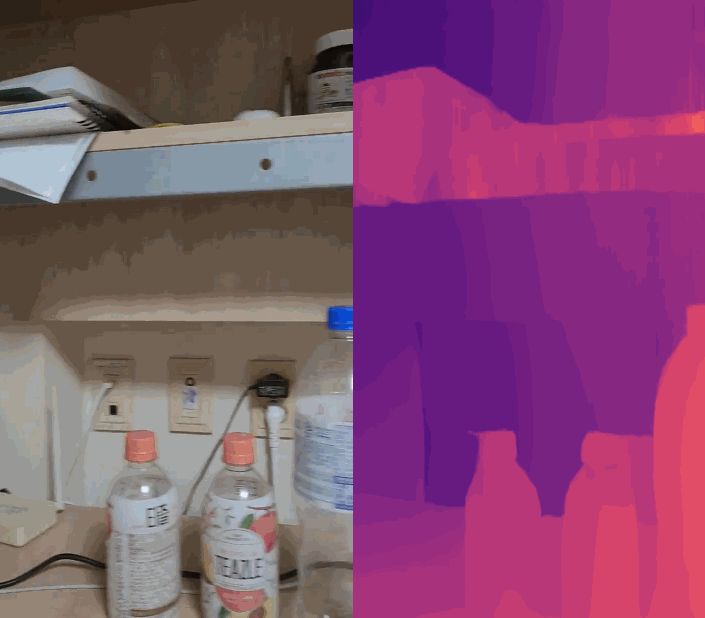
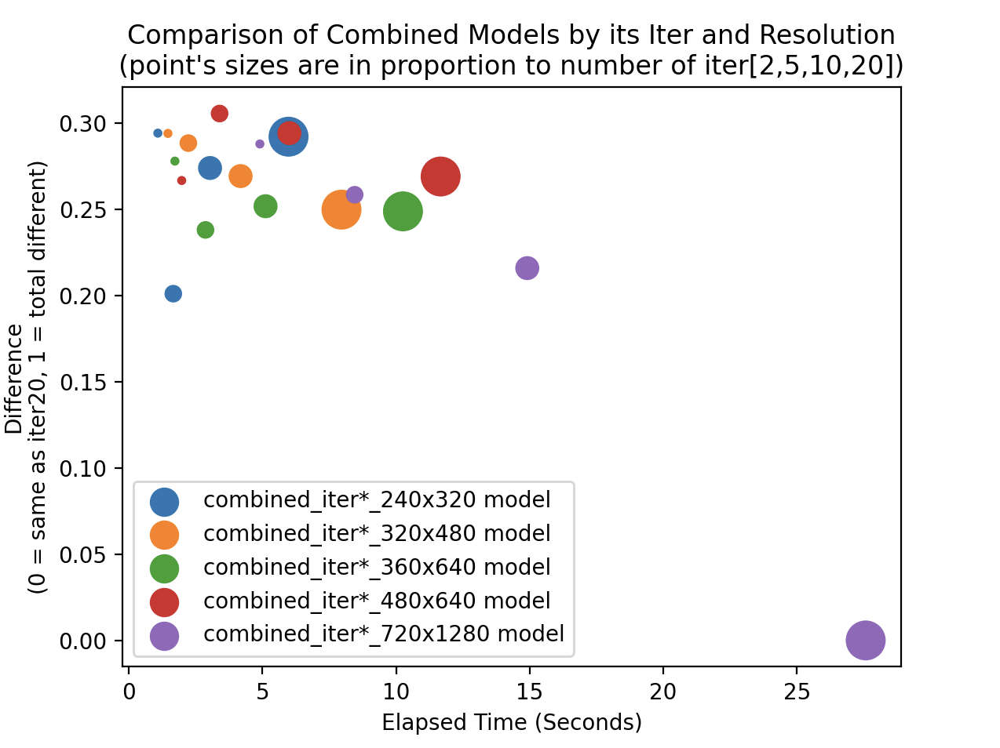
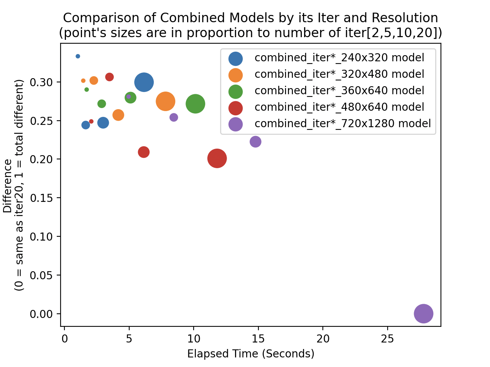

# OpensourceSW 입문 Project
> Original Code from ibaiGorordo's [ONNX-CREStereo-Depth-Estimation](https://github.com/ibaiGorordo/ONNX-CREStereo-Depth-Estimation)
### Team Introduction
##### 박성우 202211298 프로젝트 중 모든 역할

### Topic Introduction
## *Stereo Depth Estimation*
해당 Github Repo에서는
한번에 두개의(왼쪽과 오른쪽으로 편차가 있는 Stereo) 이미지 혹은 동영상정보들이
인풋으로 들어가게 되고 ONNX기반의 CREStereo 모델을 통하여 두 인풋을 통해 하나의
depth를 도출해주는 Python Scripts를 다룹니다.

> ONNX란? 간단하게 설명하면, pytorch같은 tensorflow 서로 다른 두 환경에서 만들어진 모델들을
> 서로 호환가능하게 ONNX로 변환하여 ONNX runtime위에서 실행할 수 있게 해주는겁니다.

Depth Map은 컴퓨터 그래픽스에서 요긴하게 이용되는 요소입니다.
그렇기에 게임에서 볼 수 있는 각종 그래픽 효과들을 만들 때도 많이 사용되고 있습니다.
현대의 대부분의 GPU는 하드웨어 레벨에서 이를 위한 depth testing 지원하고 있습니다.

* Depth Map을 활용한 Outline 효과 : https://www.ronja-tutorials.com/post/019-postprocessing-outlines/
* Pure Depth SSAO : https://theorangeduck.com/page/pure-depth-ssao

하지만 사진등은(비트맵) 픽셀에 대한 정보만을 가지고 있지 깊이 정보를 가지고 있지 않기 때문에
일반 사진, 영상에서 이 depth을 그냥 만들어낼 수는 없습니다.
그런 일반 사진에서 depth맵을 estimation하는 것이 이 Repo에서 다루고 있는 것입니다.

### Results
### Input1


### Result1

---
### Input2

### Result2

---
## Results(Video)
### Input
사용한 영상 : input_files/video_left.mp4, input_files/video_right.mp4
### Results
<p align="center">



</p>
---
## Analysis/Visualization

#### * Stereo Depth Estimation 분석
Stereo 방식으로 Depth를 추정한다. Input으로 두개의 영상이 들어가는데, 살짝 왼쪽에서 찍은 사진, 살짝 오른쪽에서 찍은 사진이 필요하다.
이는 인간이 원근감을 느끼는 방식과 거의 유사함을 알 수 있는데, 왼쪽눈에서 들어오는 정보와 오른쪽 눈에서 들어오는 정보를 규합하여 좌우의 상이 얼마나 변했는지에 따라서 원근감을 느끼게 된다. (먼 곳에 있는 물체는 몸을 움직여도 거의 움직이지 않고 가까이에 있는 물체는 빠르게 움직임을 생각해보자) 이를 인공지능 모델로서 구현해낸 것으로 보인다.

#### * Cross Eye에 적용해보기

유튜브 영상에서 Cross Eye (한국에서는 흔히들 매직아이라고 부르는)로 3D를 체험할 수 있는 영상들을 찾아 볼 수 있다.
상술했듯, 사람의 눈과 비슷한 방식으로 depth를 측정한다고 생각하여 여러 영상들을 찾아 적용해보았다.
매직아이를 할 때 왼쪽눈은 오른쪽 이미지, 오른쪽 눈은 왼쪽 이미지를 보고 초점을 맞추기 때문에 Inference를 할 때
left와 right를 바꾼 경우, 영상 그대로 사용한 경우로 나누어서 퀄리티가 달라지는지 테스트 해보았다.


left와 right를 바꾼 경우에 Output의 퀄리티가 달라지는 흥미로운 결과를 얻을 수 있었다.
바꾸지 않아도 어느정도 실행이 됨을 알 수 있지만, 바꾼 경우가 육안으로 봐도 더 잘 Estimate함을 알 수 있었다.

#### * 모델별 Output 디테일 비교 그래프

모델들의 디테일과 효율을 따져보기로 했다. (Combined 모델만 사용함)
모델의 iter과 resolution 늘어나면 늘어날수록 그 퀄리티(디테일)가 좋아질 것이라고 기대할 수 있고
그렇기 때문에 iter20, 720x1280 모델로 생성된 Output를 Best Output으로 가정하고
다른 iter, resolution인 모델들의 Output과 비교해보았다.

사용한 데이터는 이것이다. (left 이미지)




두 그래프의 평균을 낸 그래프


원의 크기가 클 수록, 큰 iter라는 의미다.
그래프를 분석해보자면
좌측 아래에 가까울수록, iter20에 720x1280의 디테일에 가까우면서
실행속도가 가장 빠른 model이라고 할 수 있으므로 가장 효율적인 model이라고 할 수 있을 것이다.
그렇기 때문에 사용한 ONNX모델 특히 Combined 모델 중에서 가장 효율적인 모델은 이 그래프만 보고 얘기하자면
480x640 중에서도 iter10이 가장 효율이 좋다고 할 수 있다.

만약 실행속도를 더 챙기고 싶다면, 480x640모델에서 iter2모델, 혹은 240x320모델의 iter5모델을 사용하는 것이 좋을 것이다.

## Installation / Inference
#### (참고) Tested Device
* Macbook M1 Chip, python3.11
* No Nvidia GPU
---
### 1. git clone
```
git clone https://github.com/seongwooPark22/opensw23-SWP.git
cd opensw23-SWP
```
### 2. Install requirements 

> venv나 virtualenv로 가상환경을 먼저 설정하고 하는 것을 추천합니다.

reqirements.txt 내부를 이렇게 바꿔주세요

* 만약 NVIDIA GPU를 사용하는 컴퓨터라면 -> `onnxruntime-gpu` -> 변경X
* 만약 NVIDIA GPU를 사용하지 않는 컴퓨터라면 : `onnxruntime-gpu` -> `onnxruntime`

수정한 후 
```
pip install -r requirements.txt
```

Video Inference는 Youtube 영상의 URL을 사용하기때문에
이를 실행하기 위해서는 yt-dlp를 설치해야합니다.
```
pip install yt-dlp
```

### 3. Download Pre-Trained Model
#### ONNX Model

The models were converted from the Pytorch implementation below by [PINTO0309](https://github.com/PINTO0309)

Model : https://github.com/PINTO0309/PINTO_model_zoo/tree/main/284_CREStereo
> The License of the models is Apache-2.0 License: https://github.com/megvii-research/CREStereo/blob/master/LICENSE

위 Model 링크에서 .sh파일 받아 실행하여 생성된 파일을 models폴더로 옮겨 주세요
```
sh [file_you_download]
```
주의
> 윈도우 사용자라면, .sh 파일을 실행하기 위해 git bash를 사용하거나
> Cygwin 등을 사용하는 방법이 있으니 참고해주세요

소스코드 (image_depth_estimation.py, video_depth_estimation.py)의 iter과 .sh 파일의 iter이 동일해야 합니다. (기본 5)
그래서 바로 사용하시려면 iter5인 모델을 다운받으면 좋습니다.
저는 `download_iter05_tensorrt.sh`로 모델을 다운로드 받았습니다.

iter은 2, 5, 10, 20으로만 설정가능하며 숫자가 클수록 퀄리티가 좋아집니다. 소스코드에서 직접 수정하실 수 있습니다.

1. Inference
* Image inference (URL/파일을 인풋으로 작동함)
```
python image_depth_estimation.py
```
해당 파일을 실행하면 어떤 이미지 파일/URL을 사용할지 입력할 수 있습니다.
```
Left Image Path (URL or File) : [File path or Image URL]
Right Image Path (URL or File) : [FIle path or Image URL]
```

* Video Inference1 (무조건 파일의 경로를 입력하셔야합니다)
```
python video_depth_estimation_seperate_file.py
```
실행 시
```
Left Video file Path : [File path]
Right Video file Path : [File path]
```
왼쪽 영상과 오른쪽 영상이 따로 분리되어있는 경우에 사용합니다. 오로지 파일 경로만을 입력하실 수 있습니다.

* Video Inference2 (Youtube 영상의 URL, 로컬의 파일경로를 인풋으로 동작함)
```
python video_depth_estimation.py
```
실행 시
```
Stereo Video URL/Path : [File path or Video URL]
Swap left and right(y/n) : [y/n]
```
좌우 영상이 통합된 경우 사용합니다.
해당 파일을 실행하면 어떤 Youtube 영상을 사용할 지 URL을 입력하거나 가지고 있는 영상 파일의 경로를 입력하실 수 있습니다.
사용가능한 영상의 Format이 정해져 있는데, 아래와 같습니다.


Swap left and right는 영상의 좌우를 바꿔서 처리할지 물어보는겁니다.
CrossEye 영상을 사용할 때에 y로 하시면 좋습니다(보통 반대로 되있기 때문)

q, esc 키를 누르면 영상 Inference에서 빠져나올 수 있게 만들었습니다만...
프로그램이 CPU로만 돌아간다면 부하가 많이 걸려 키 입력이 제대로 입력이 되지 않는 경우가 자주 생깁니다.
그럴 경우에는 실행중인 터미널이나 생성된 윈도우를 강제종료해주시면 됩니다.

2. Additional Script
```
compare_image.py
```
위의 Depth Estimation과는 전혀 관계없는 편의 스크립트입니다.
해당 스크립트를 실행하면 두 이미지를 인풋으로 얼마나 유사한지를 나타내줍니다.
위에 나타낸 그래프를 만들기위한 데이터를 수집하기위하여 만들었습니다.

0에 가까울 수록 비슷한 것이고 1에 가까울수록 다르다는 것입니다.
예를 들어 같은 이미지를 인풋으로 입력하면 0.0이 출력될겁니다.
### Presentation
